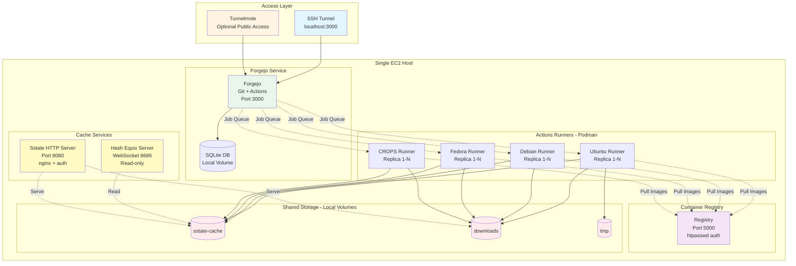
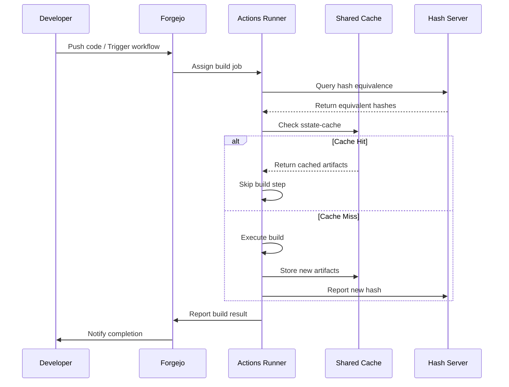
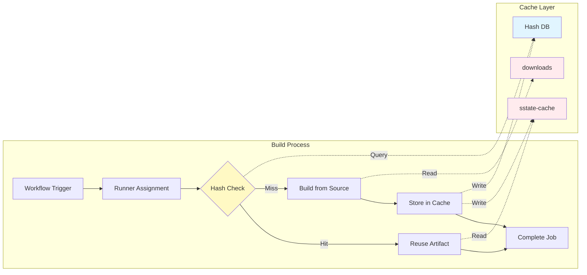
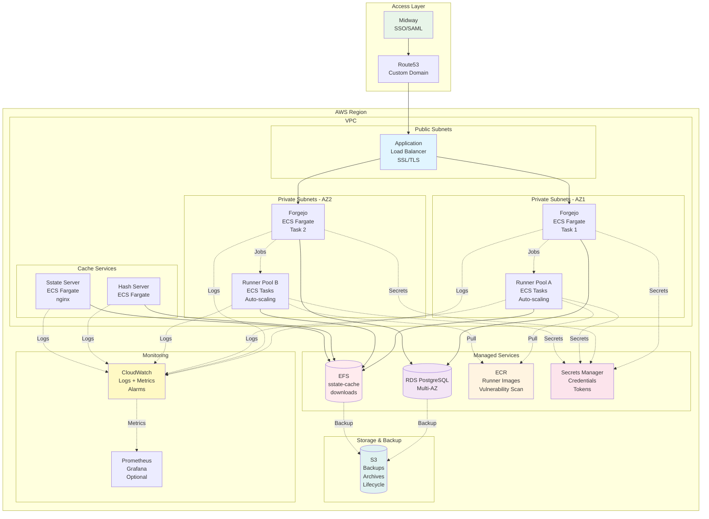
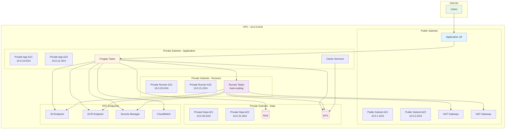
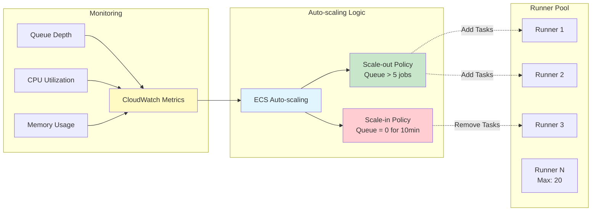

# Production Readiness Assessment

**Date:** February 26, 2026  
**Status:** POC → Production Evaluation  
**Repository:** https://github.com/thomas-roos/yocto-forge-container

## Executive Summary

Yocto Forge Container is a self-hosted CI/CD infrastructure for Yocto embedded Linux development using Forgejo (Git forge) with Actions runners. The POC has been successfully deployed and tested on EC2, demonstrating effective shared build caching and multi-OS runner support. This document outlines the current implementation and identifies gaps for production deployment.

## Table of Contents

- [Project Overview](#project-overview)
- [Current Architecture](#current-architecture)
- [Production Architecture](#production-architecture)
- [Production Readiness Gaps](#production-readiness-gaps)
- [Implementation Roadmap](#implementation-roadmap)
- [Estimated Effort](#estimated-effort)
- [Success Criteria](#success-criteria)

## Project Overview

### What It Does

Provides a complete CI/CD environment for Yocto builds with:

- **Self-hosted Git service** (Forgejo) with integrated Actions (CI/CD)
- **Multi-OS build runners** (Ubuntu, Debian, Fedora, CROPS)
- **Shared build cache** (sstate-cache, downloads) across all builds
- **Hash Equivalence Server** for intelligent build artifact reuse
- **HTTP Sstate Server** for remote cache access with authentication
- **Local container registry** for runner images

### Key Features

**Build Optimization:**
- Shared sstate-cache and downloads across all runners
- Hash Equivalence Server (WebSocket) for build artifact reuse
- HTTP Sstate Server with password authentication for remote access
- Configurable runner replicas for parallel builds

**Multi-OS Support:**
- Ubuntu 22.04, 24.04
- Debian 12, 13
- Fedora 42, 43
- CROPS (automatic UID/GID mapping - recommended)

**Security:**
- Registry password protection (htpasswd)
- Sstate server HTTP basic auth
- Localhost-only Forgejo binding
- SSH tunnel access pattern

### Current Deployment Status

**Tested Environment:**
- ✅ EC2 workstation deployment
- ✅ All runners on same host (Podman containers)
- ✅ SSH tunnel for web interface access
- ✅ Successfully tested with aws4embeddedlinux/meta-aws-demos workflow
- ✅ Shared sstate cache working effectively
- ✅ Multi-OS runner support validated
- ✅ Automatic runner registration functional

## Current Architecture

### POC Architecture Diagram

### Current Data Flow

### Component Interaction

## Production Architecture

### Target Production Architecture

### Production Network Architecture

### Auto-scaling Architecture

## Production Readiness Gaps

### 1. Infrastructure as Code (Critical)

**Current State:**
- Manual setup via shell scripts
- docker-compose.yml with manual configuration
- No automated provisioning

**Required:**
- **CDK Application** for full infrastructure deployment
  - VPC, subnets, security groups
  - ECS/Fargate for runner orchestration
  - EFS for shared cache storage
  - Application Load Balancer
  - Route53 DNS configuration
  - Secrets Manager integration
- **Reference:** Similar to Yocto-Build GitLab POC (code.amazon.com/packages/Yocto-Build)
- **Terraform alternative** if CDK not preferred

**Implementation Tasks:**
- [ ] Create CDK project structure
- [ ] Define VPC and networking resources
- [ ] Define ECS cluster and task definitions
- [ ] Configure EFS file systems
- [ ] Set up RDS database
- [ ] Configure ALB and target groups
- [ ] Implement Secrets Manager integration
- [ ] Create deployment pipeline

### 2. Horizontal Scaling (Critical)

**Current State:**
- All runners on single EC2 instance
- Limited by single host resources
- No auto-scaling

**Required:**
- **ECS/Fargate runner deployment**
  - Runners as ECS tasks
  - Auto-scaling based on queue depth
  - Spot instance support for cost optimization
- **Distributed runner architecture**
  - Runner registration service
  - Dynamic runner provisioning
  - Health monitoring and auto-recovery
- **Load balancing** for multiple Forgejo instances (if needed)

**Implementation Tasks:**
- [ ] Convert runners to ECS task definitions
- [ ] Implement auto-scaling policies
- [ ] Configure CloudWatch metrics for scaling
- [ ] Set up Spot instance integration
- [ ] Implement runner health checks
- [ ] Create runner registration automation

### 3. Access Management (Critical)

**Current State:**
- SSH tunnel to localhost:3000
- No proper domain
- No SSO integration

**Required:**
- **Midway integration** for Amazon internal access
- **Custom domain** with SSL/TLS certificates
- **SSO/SAML integration** with Amazon authentication
- **Network security**
  - Security groups
  - VPC endpoints
  - Private subnets for runners

**Implementation Tasks:**
- [ ] Request Midway integration
- [ ] Configure custom domain in Route53
- [ ] Set up SSL/TLS certificates (ACM)
- [ ] Implement SAML authentication
- [ ] Configure security groups
- [ ] Set up VPC endpoints
- [ ] Document access procedures

### 4. Storage Architecture (High Priority)

**Current State:**
- Local volumes on EC2 instance
- No backup strategy
- Single point of failure

**Required:**
- **EFS for shared cache**
  - sstate-cache on EFS
  - downloads on EFS
  - Proper mount targets across AZs
- **S3 for long-term storage**
  - Forgejo data backups
  - Build artifact archival
  - Lifecycle policies
- **RDS for Forgejo database** (instead of SQLite)
  - PostgreSQL recommended
  - Multi-AZ deployment
  - Automated backups

**Implementation Tasks:**
- [ ] Create EFS file systems
- [ ] Configure EFS mount targets
- [ ] Set up EFS access points
- [ ] Create S3 buckets with lifecycle policies
- [ ] Provision RDS PostgreSQL instance
- [ ] Migrate SQLite to PostgreSQL
- [ ] Configure automated backups
- [ ] Test backup restoration

### 5. Monitoring & Observability (High Priority)

**Current State:**
- Basic container logs
- No metrics collection
- No alerting

**Required:**
- **CloudWatch integration**
  - Container logs to CloudWatch Logs
  - Custom metrics (build duration, cache hit rate)
  - Dashboards for build health
- **Prometheus/Grafana** (optional)
  - Runner metrics
  - Cache server metrics
  - Build queue depth
- **Alerting**
  - Failed builds
  - Runner health issues
  - Storage capacity warnings
  - Cache server downtime

**Implementation Tasks:**
- [ ] Configure CloudWatch Logs integration
- [ ] Create custom CloudWatch metrics
- [ ] Build CloudWatch dashboards
- [ ] Set up CloudWatch alarms
- [ ] Implement SNS notifications
- [ ] Optional: Deploy Prometheus/Grafana
- [ ] Create runbooks for alerts

### 6. Security Hardening (High Priority)

**Current State:**
- Basic htpasswd authentication
- Hardcoded credentials in .env
- No secrets rotation

**Required:**
- **Secrets Manager**
  - Admin credentials
  - Registry passwords
  - Runner tokens
  - Database credentials
- **IAM roles** for service authentication
- **Network isolation**
  - Private subnets for runners
  - VPC endpoints for AWS services
  - Security group restrictions
- **Vulnerability scanning**
  - ECR image scanning
  - Dependency scanning in builds
- **Audit logging**
  - CloudTrail for API calls
  - Forgejo audit logs

**Implementation Tasks:**
- [ ] Migrate credentials to Secrets Manager
- [ ] Create IAM roles for services
- [ ] Configure security groups
- [ ] Enable ECR vulnerability scanning
- [ ] Set up CloudTrail logging
- [ ] Configure Forgejo audit logging
- [ ] Implement secrets rotation
- [ ] Security review and penetration testing

### 7. Backup & Disaster Recovery (Medium Priority)

**Current State:**
- No backup strategy
- No disaster recovery plan

**Required:**
- **Automated backups**
  - Forgejo data (repositories, database)
  - Build cache snapshots
  - Configuration backups
- **Disaster recovery procedures**
  - RTO/RPO definitions
  - Recovery runbooks
  - Cross-region replication (if needed)
- **Testing**
  - Regular backup restoration tests
  - DR drills

**Implementation Tasks:**
- [ ] Define RTO/RPO requirements
- [ ] Configure automated RDS backups
- [ ] Set up EFS backup to S3
- [ ] Create disaster recovery runbooks
- [ ] Implement cross-region replication (if needed)
- [ ] Schedule regular DR tests
- [ ] Document recovery procedures

### 8. Documentation (Medium Priority)

**Current State:**
- Good README for POC setup
- No operational runbooks
- No architecture diagrams

**Required:**
- **Operational documentation**
  - Deployment procedures
  - Troubleshooting guides
  - Runbooks for common issues
- **Architecture documentation**
  - Network diagrams
  - Data flow diagrams
  - Security architecture
- **User documentation**
  - How to create workflows
  - How to use shared cache
  - Best practices for Yocto builds

**Implementation Tasks:**
- [ ] Create deployment documentation
- [ ] Write troubleshooting guides
- [ ] Document common issues and solutions
- [ ] Create architecture diagrams
- [ ] Write user guides
- [ ] Document best practices
- [ ] Create video tutorials (optional)

### 9. Cost Optimization (Medium Priority)

**Current State:**
- Single EC2 instance
- No cost tracking

**Required:**
- **Resource tagging** for cost allocation
- **Spot instances** for runners
- **Auto-scaling policies** to minimize idle resources
- **Cache lifecycle policies** to manage storage costs
- **Cost monitoring** and alerts

**Implementation Tasks:**
- [ ] Implement resource tagging strategy
- [ ] Configure Spot instance usage
- [ ] Optimize auto-scaling policies
- [ ] Set up S3 lifecycle policies
- [ ] Configure cost allocation tags
- [ ] Create cost monitoring dashboards
- [ ] Set up budget alerts

### 10. CI/CD for Infrastructure (Low Priority)

**Current State:**
- Manual deployment
- No testing pipeline

**Required:**
- **Infrastructure CI/CD**
  - Automated CDK deployment
  - Infrastructure testing
  - Staged rollouts (dev → staging → prod)
- **Runner image CI/CD**
  - Automated builds on Dockerfile changes
  - Security scanning
  - Automated registry push

**Implementation Tasks:**
- [ ] Create infrastructure deployment pipeline
- [ ] Implement infrastructure tests
- [ ] Set up staging environment
- [ ] Create runner image build pipeline
- [ ] Integrate security scanning
- [ ] Automate image promotion

## Implementation Roadmap

### Phase 1: Foundation (Weeks 1-2)

**Goals:**
- Establish core infrastructure
- Migrate from single-host to distributed architecture

**Tasks:**
- Convert to CDK application
- Deploy to ECS/Fargate
- Implement EFS for shared cache
- Set up RDS for Forgejo database
- Configure Midway access

**Deliverables:**
- Working CDK application
- ECS-based deployment
- Shared storage on EFS
- PostgreSQL database
- Basic access via Midway

### Phase 2: Security & Reliability (Weeks 3-4)

**Goals:**
- Harden security posture
- Implement monitoring and backups

**Tasks:**
- Integrate Secrets Manager
- Implement IAM roles
- Set up CloudWatch monitoring
- Configure automated backups
- Implement security groups and network isolation

**Deliverables:**
- Secrets in Secrets Manager
- IAM-based authentication
- CloudWatch dashboards and alarms
- Automated backup system
- Secure network architecture

### Phase 3: Scaling & Optimization (Weeks 5-6)

**Goals:**
- Enable horizontal scaling
- Optimize costs and performance

**Tasks:**
- Implement auto-scaling for runners
- Add Prometheus/Grafana monitoring (optional)
- Implement cost optimization (Spot instances)
- Set up alerting
- Performance tuning

**Deliverables:**
- Auto-scaling runner pool
- Advanced monitoring (optional)
- Cost-optimized infrastructure
- Comprehensive alerting
- Performance benchmarks

### Phase 4: Operations & Documentation (Weeks 7-8)

**Goals:**
- Prepare for production handoff
- Complete documentation

**Tasks:**
- Create operational runbooks
- Disaster recovery testing
- User documentation
- Training sessions
- Handoff to operations team

**Deliverables:**
- Complete operational documentation
- Tested DR procedures
- User guides and training materials
- Operations team trained
- Production readiness sign-off

## Estimated Effort

### Development Resources

| Phase | Duration | Engineers | Focus Areas |
|-------|----------|-----------|-------------|
| Phase 1 | 2 weeks | 1-2 | Infrastructure, CDK, ECS |
| Phase 2 | 2 weeks | 1-2 | Security, Monitoring, Backups |
| Phase 3 | 2 weeks | 1-2 | Scaling, Optimization |
| Phase 4 | 2 weeks | 1-2 | Documentation, Training |
| **Total** | **8 weeks** | **1-2** | **Full stack** |

### Additional Time

- **Testing & Validation:** 2-3 weeks
- **Documentation & Training:** 1-2 weeks (included in Phase 4)
- **Buffer for unknowns:** 1-2 weeks

**Total Estimated Time:** 11-13 weeks

### Skills Required

- AWS infrastructure (VPC, ECS, RDS, EFS)
- CDK or Terraform
- Container orchestration
- CI/CD systems
- Yocto build system knowledge
- Security best practices
- Monitoring and observability

## Dependencies

### External Dependencies

- **AWS Account** with appropriate permissions
- **Midway integration** approval and setup
- **Domain name** for service
- **Budget approval** for AWS resources
- **Operations team** availability for handoff

### Technical Dependencies

- **Forgejo** compatibility with RDS PostgreSQL
- **EFS performance** for Yocto build workloads
- **ECS Fargate** support for privileged containers (runners)
- **Midway** SAML integration capabilities

### Organizational Dependencies

- Security review and approval
- Network team for VPC setup
- Operations team for handoff
- Budget approval process

## Success Criteria

### Technical Metrics

- ✅ **Automated deployment** via CDK
- ✅ **Runners scale automatically** based on demand (0-20 instances)
- ✅ **99.5% uptime SLA** for Forgejo service
- ✅ **Shared cache hit rate** > 80%
- ✅ **Build time reduction** > 50% vs. local builds
- ✅ **Full monitoring** and alerting in place
- ✅ **Disaster recovery** tested and documented
- ✅ **Security scan** passed with no critical issues

### Operational Metrics

- ✅ **Operations team trained** and ready
- ✅ **Documentation complete** (architecture, runbooks, user guides)
- ✅ **DR drill successful** within RTO/RPO targets
- ✅ **Cost tracking** implemented and within budget
- ✅ **Auto-scaling** tested under load

### Business Metrics

- ✅ **Developer adoption** > 80% of Yocto teams
- ✅ **Build queue time** < 5 minutes average
- ✅ **Cost per build** < $X (define target)
- ✅ **Support tickets** < 5 per week after stabilization

## References

- **Current POC:** https://github.com/thomas-roos/yocto-forge-container
- **GitLab CDK Reference:** code.amazon.com/packages/Yocto-Build
- **Test Workflow:** aws4embeddedlinux/meta-aws-demos/.github/workflows/build-gg-lite.yml
- **Forgejo Documentation:** https://forgejo.org/docs/latest/
- **AWS ECS Best Practices:** https://docs.aws.amazon.com/AmazonECS/latest/bestpracticesguide/
- **Yocto Project:** https://www.yoctoproject.org/

## Appendix

### A. Cost Estimation

**Monthly AWS Costs (Estimated):**

| Service | Configuration | Monthly Cost |
|---------|--------------|--------------|
| ECS Fargate (Forgejo) | 2 tasks, 2 vCPU, 4GB RAM | ~$100 |
| ECS Fargate (Runners) | Avg 5 tasks, 4 vCPU, 8GB RAM | ~$500 |
| RDS PostgreSQL | db.t3.medium, Multi-AZ | ~$150 |
| EFS | 500GB, Standard | ~$150 |
| ALB | Standard | ~$25 |
| Data Transfer | Moderate | ~$50 |
| CloudWatch | Logs + Metrics | ~$25 |
| **Total** | | **~$1,000/month** |

*Note: Costs will vary based on actual usage. Spot instances can reduce runner costs by 70%.*

### B. Glossary

- **CDK:** AWS Cloud Development Kit - Infrastructure as Code framework
- **CROPS:** Collaborative Runtime for Optimized Portable Systems - Docker-based Yocto build environment
- **ECS:** Elastic Container Service - AWS container orchestration
- **EFS:** Elastic File System - AWS managed NFS
- **Fargate:** Serverless compute engine for containers
- **Forgejo:** Self-hosted Git service with Actions (CI/CD)
- **Hash Equivalence:** Yocto feature to reuse build outputs with equivalent inputs
- **Midway:** Amazon internal access gateway
- **RDS:** Relational Database Service - AWS managed databases
- **sstate-cache:** Yocto shared state cache for build artifacts
- **SSO:** Single Sign-On
- **VPC:** Virtual Private Cloud - Isolated network in AWS
