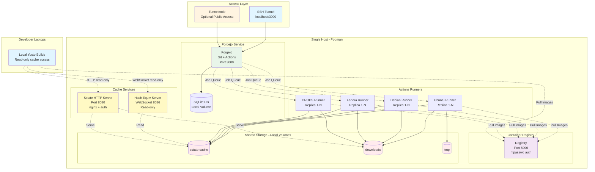
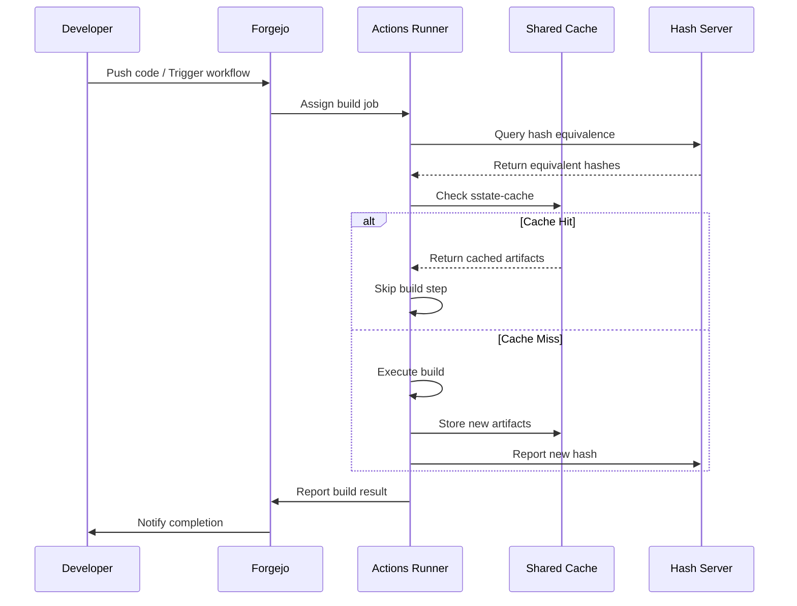
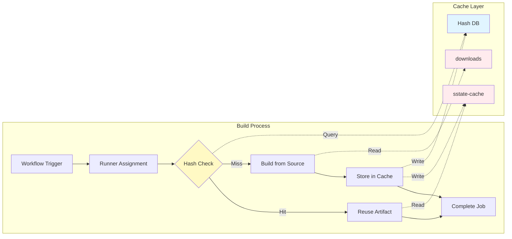
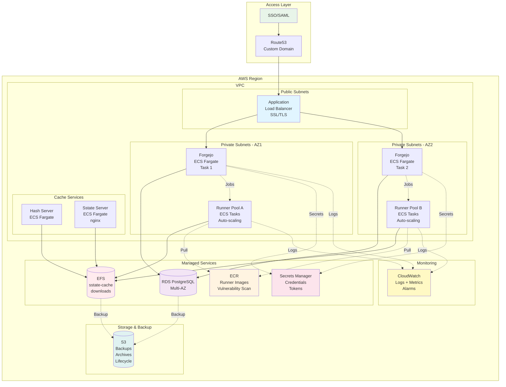
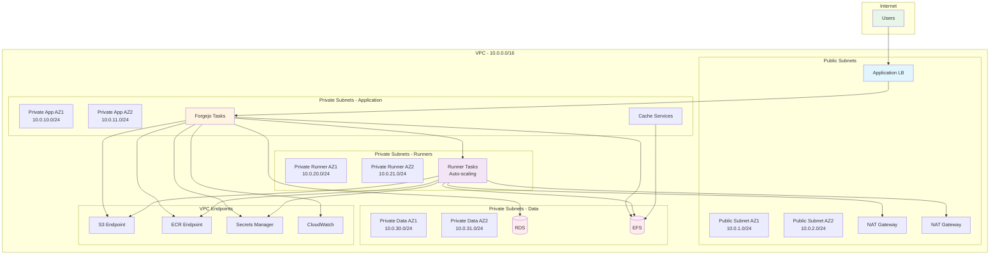
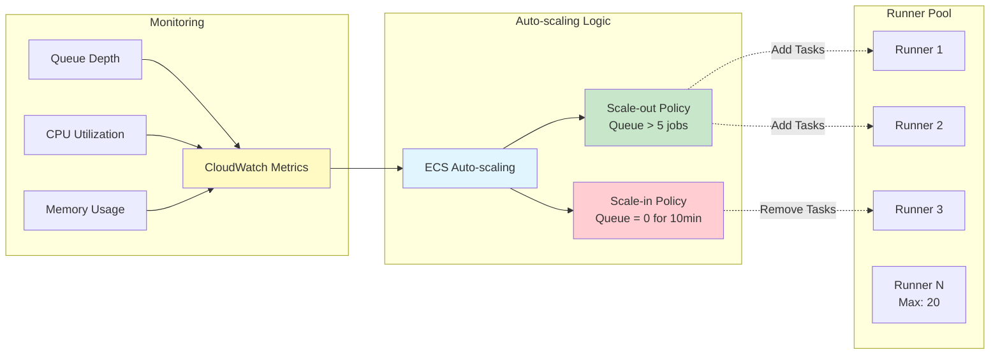

# Forgejo for Yocto Development

Podman-based Forgejo setup for Yocto development with Actions runners, shared caches, and optional public access via Tunnelmole.

**Status:** POC — successfully deployed and tested on EC2. Designed for easy, fast setup on a single host — not for scale. See [Production Readiness](#production-readiness) for what a scaled deployment could look like.

## Features

- Forgejo Git service (v14.0.1) with integrated Actions (CI/CD)
- Multi-OS Actions runners (Ubuntu 22.04/24.04, Debian 12/13, Fedora 42/43, CROPS)
- Shared Yocto caches (sstate-cache, downloads) across all builds
- Hash Equivalence server for intelligent build artifact reuse
- HTTP sstate-cache server with password authentication
- Local container registry for runner images (htpasswd protected)
- SSH tunnel access (secure, recommended)
- Optional Tunnelmole integration for public access
- Configurable runner replicas for parallel builds

## Prerequisites

- Podman
- Podman Compose

## Quick Start

```bash
cp .env.example .env           # Edit to customize
./setup.sh                     # Generate config, start services, create admin user
```

### What it does

1. Generates `docker-compose.override.yml` from `RUNNERS` in `.env`
2. Creates data directories with correct permissions
3. Starts Forgejo, registry, and all configured runners
4. Creates admin user with random password (saved to `.forgejo-admin-password`)
5. Runners auto-register using admin credentials

### Access Forgejo

**Via SSH tunnel (from your laptop):**
```bash
ssh -L 3000:localhost:3000 user@<server-ip>
# Then open: http://localhost:3000
```

**Via Tunnelmole (public access):**
```bash
./manage.sh start --tunnel
podman logs forgejo-tunnelmole  # Get public URL
```

### Daily operations

```bash
./manage.sh start              # Start services
./manage.sh start --tunnel     # Start with public access
./manage.sh stop               # Stop services
./manage.sh restart            # Restart services
./manage.sh logs               # View all logs
./manage.sh logs forgejo       # View specific service
./manage.sh ps                 # Show running services
./manage.sh clean              # Stop and remove all data
./manage.sh cache-start        # Start hash equivalence + HTTP cache servers
./manage.sh cache-stop         # Stop cache servers
```

## Configuration

Edit `.env` to customize:

```bash
# Registry
USE_LOCAL_REGISTRY=true
REGISTRY_URL=localhost:5000

# Runners (comma-separated, must match Dockerfile names without "Dockerfile." prefix)
RUNNERS=yocto-runner-ubuntu-22.04,yocto-runner-ubuntu-24.04,yocto-runner-debian-12,yocto-runner-debian-13,yocto-runner-fedora-42,yocto-runner-fedora-43,yocto-runner-crops

# Number of runner instances per OS
RUNNER_REPLICAS=1

# Admin credentials for auto-registration
FORGEJO_ADMIN_USER=forgejo

# Optional: Manual runner token (if auto-registration fails)
FORGEJO_RUNNER_TOKEN=

# Forgejo
FORGEJO_VERSION=14.0.1
FORGEJO_DOMAIN=localhost
FORGEJO_ROOT_URL=http://localhost:3000/
```

## Access Methods

### SSH Tunnel (Recommended)

Forgejo is bound to `127.0.0.1:3000` for security. Access via SSH tunnel:

```bash
ssh -L 3000:localhost:3000 user@<server-ip>
# Then open: http://localhost:3000
```

### Tunnelmole (Optional Public Access)

For temporary public access without SSH:

```bash
./start.sh --tunnel
podman-compose logs tunnelmole
# Look for: https://abc123.tunnelmole.net is forwarding to http://forgejo:3000
```

Note: Tunnelmole URL changes on each restart (free tier) and has bandwidth limits.

## Using Shared Build Cache

Development laptops can consume the same sstate-cache and downloads used by the CI runners, massively speeding up local builds. By pointing your local Yocto setup at the server's HTTP cache and hash equivalence service, most build steps become cache hits instead of full rebuilds.

It is recommended that developer machines use the cache in read-only mode (the default for HTTP/WebSocket clients) so that only CI runners populate the shared cache with validated artifacts. If developers also write to the cache, inconsistent or broken artifacts could affect all users.

For release builds, consider running without any shared cache to ensure fully reproducible, clean builds from source.

### Client Configuration

Set up authentication and Yocto configuration on machines consuming the cache. Replace `<server-ip>` with your server's IP address.

```bash
# Setup authentication (one-time)
cat > ~/.netrc << EOF
machine <server-ip>
login yocto
password changeme123
EOF
chmod 600 ~/.netrc

# Configure Yocto (add to local.conf or export in workflow)
SSTATE_MIRRORS = "file://.* http://<server-ip>:8080/sstate-cache/PATH"
PREMIRRORS:prepend = "git://.*/.* http://<server-ip>:8080/downloads/ \n"
PREMIRRORS:prepend = "ftp://.*/.* http://<server-ip>:8080/downloads/ \n"
PREMIRRORS:prepend = "http://.*/.* http://<server-ip>:8080/downloads/ \n"
PREMIRRORS:prepend = "https://.*/.* http://<server-ip>:8080/downloads/ \n"
BB_HASHSERVE = "wss://<server-ip>:8686/ws"
BB_SIGNATURE_HANDLER = "OEEquivHash"
BB_HASHSERVE_UPSTREAM = "wss://hashserv.yoctoproject.org/ws"
```

### Complete Workflow Example

```bash
# Setup authentication
cat > ~/.netrc << EOF
machine <server-ip>
login yocto
password changeme123
EOF
chmod 600 ~/.netrc

# Configure Yocto
export SSTATE_MIRRORS="file://.* http://<server-ip>:8080/sstate-cache/PATH"
export PREMIRRORS="git://.*/.* http://<server-ip>:8080/downloads/ \n ftp://.*/.* http://<server-ip>:8080/downloads/ \n http://.*/.* http://<server-ip>:8080/downloads/ \n https://.*/.* http://<server-ip>:8080/downloads/ \n"
export BB_HASHSERVE="wss://<server-ip>:8686/ws"
export BB_SIGNATURE_HANDLER="OEEquivHash"
export BB_HASHSERVE_UPSTREAM="wss://hashserv.yoctoproject.org/ws"
export BB_ENV_PASSTHROUGH_ADDITIONS="$BB_ENV_PASSTHROUGH_ADDITIONS SSTATE_MIRRORS PREMIRRORS BB_HASHSERVE BB_SIGNATURE_HANDLER BB_HASHSERVE_UPSTREAM"
```

### Hash Equivalence Server

Speeds up builds by reusing build outputs with equivalent inputs. Runs in read-only mode.

```bash
# Start
podman-compose --profile hashserv up -d

# Configure in local.conf
BB_HASHSERVE = "wss://<server-ip>:8686/ws"
BB_SIGNATURE_HANDLER = "OEEquivHash"

# Optional: upstream server for additional cache hits
BB_HASHSERVE_UPSTREAM = "wss://hashserv.yoctoproject.org/ws"
```

### HTTP Sstate-Cache Server

Serves sstate-cache and downloads over HTTP with basic auth (nginx).

```bash
# Start
podman-compose --profile sstate-server up -d

# Generate custom password file (optional, defaults: yocto/changeme123)
podman run --rm httpd:alpine htpasswd -nbB yocto <your-password> > sstate-htpasswd
```

### Server Ports

| Service | Port | Protocol | Auth | Mode |
|---------|------|----------|------|------|
| Hash Equivalence | 8686 | WebSocket | None | Read-only |
| Sstate Cache | 8080 | HTTP (`/sstate-cache/`) | htpasswd | Read-only |
| Downloads Cache | 8080 | HTTP (`/downloads/`) | htpasswd | Read-only |

## Building and Pushing Runner Images

The registry is password protected:

```bash
# Login to registry (use REGISTRY_URL from .env)
podman login <registry-url>
# Username: yocto / Password: changeme123

# Build and push
podman build -f Dockerfile.yocto-runner-ubuntu-22.04 -t <registry-url>/yocto-runner-ubuntu-22.04:latest .
podman push <registry-url>/yocto-runner-ubuntu-22.04:latest
```

**To change registry password:**
```bash
podman run --rm --entrypoint htpasswd httpd:alpine -Bbn yocto <new-password> > registry-htpasswd
podman-compose --profile registry restart
```

## Adding Custom Runners

1. Create a Dockerfile (e.g., `Dockerfile.yocto-runner-rocky-9`)
2. Add to `RUNNERS` in `.env`:
   ```bash
   RUNNERS=yocto-runner-ubuntu-22.04,yocto-runner-rocky-9
   ```
3. Regenerate and restart:
   ```bash
   ./setup.sh
   ```

## Runner Registration

Runners auto-register using a 3-step fallback:
1. **API-based** — uses `FORGEJO_ADMIN_USER`/`FORGEJO_ADMIN_PASSWORD` to generate a token
2. **Manual token** — uses `FORGEJO_RUNNER_TOKEN` if API fails
3. **Error** — logs instructions for manual token retrieval

To get a manual token:
1. Access Forgejo → Site Administration → Actions → Runners
2. Click "Create new Runner" and copy the token
3. Set `FORGEJO_RUNNER_TOKEN` in `.env`
4. Restart: `./manage.sh restart`

## Directory Structure

```
.
├── docker-compose.yml          # Core services (forgejo, registry, tunnelmole, hashserv, sstate-server)
├── docker-compose.override.yml # Generated runner services (from setup.sh)
├── .env.example                # Configuration template
├── .env                        # Your configuration (gitignored)
├── Dockerfile.yocto-runner-*   # Runner images (ubuntu, debian, fedora, crops)
├── setup.sh                    # One-time setup: generate config, start services, create admin
├── manage.sh                   # Daily operations: start, stop, logs, clean
├── runner-entrypoint.sh        # Runner container entrypoint (handles all runner types)
├── nginx-sstate.conf           # Nginx config for sstate/downloads server
├── registry-htpasswd           # Registry auth file
├── sstate-htpasswd             # Sstate server auth file
├── forgejo-data/               # Forgejo data and repositories (gitignored)
├── yocto-cache/
│   ├── sstate-cache/           # Shared Yocto state cache
│   ├── downloads/              # Shared Yocto downloads
│   └── tmp/                    # Shared tmp
├── hashserv-data/              # Hash equivalence server database
├── runner-data/                # Runner registration data (gitignored)
├── yocto-builds/               # Runner build workdirs (gitignored)
└── registry-data/              # Container registry storage (gitignored)
```

## Troubleshooting

**Runner not registering:**
- Check logs: `./manage.sh logs <runner-service-name>`
- Verify admin credentials match Forgejo setup
- Try manual token registration (see Runner Registration section)

**Registry connection issues:**
- Ensure registry is running: `./manage.sh ps`
- Check `REGISTRY_URL` in `.env` matches your setup
- For external registry, ensure it's accessible from the Podman network

**Yocto build failures:**
- Verify shared cache directories exist and are writable
- Check runner has access to Podman socket
- Review runner logs for specific errors

**Tunnelmole not working:**
- Check logs: `./manage.sh logs tunnelmole`
- Ensure forgejo service is running
- Free tier has bandwidth limits

## Architecture

### Current POC Architecture



### Build Data Flow



### Component Interaction



## Production Readiness

### Target Production Architecture



### Production Network Architecture



### Auto-scaling Architecture



## Glossary

| Term | Definition |
|------|-----------|
| CROPS | Collaborative Runtime for Optimized Portable Systems — Docker-based Yocto build environment |
| Forgejo | Self-hosted Git service with Actions (CI/CD), fork of Gitea |
| Hash Equivalence | Yocto feature to reuse build outputs with equivalent inputs |
| sstate-cache | Yocto shared state cache for build artifacts |

## References

- [Forgejo Documentation](https://forgejo.org/docs/latest/)
- [Yocto Project](https://www.yoctoproject.org/)
- [AWS ECS Best Practices](https://docs.aws.amazon.com/AmazonECS/latest/bestpracticesguide/)

## License

See [LICENSE](LICENSE) file.
